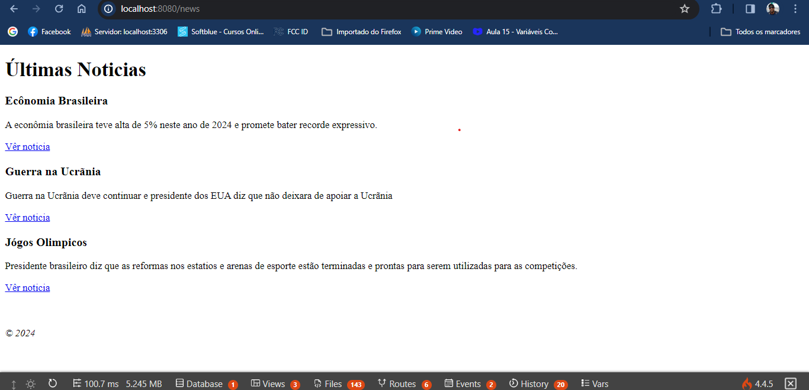
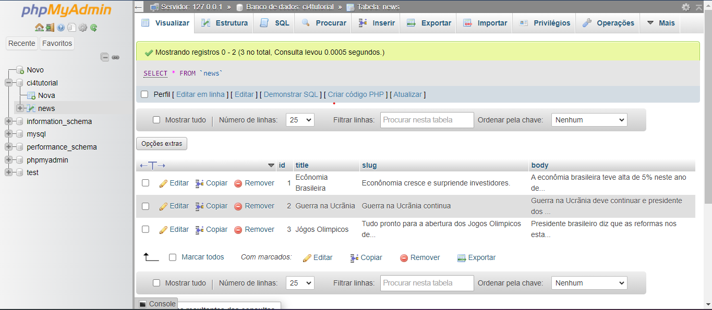

[![Contributors][contributors-shield]][contributors-url]
[![Forks][forks-shield]][forks-url]
[![Stargazers][stars-shield]][stars-url]
[![Issues][issues-shield]][issues-url]
[![MIT License][license-shield]][license-url]


<!-- 

CTRL + H

Find    -> <https://pabloalves26.github.io/portfoliopro/>
Replace -> Repo name   [e.g. Portfolio]


Find    -> <PORT>
Replace -> Port number [e.g. 4321]

-->

<!-- PROJECT LOGO -->
<br />
<samp>
<p align="center">
  <a href="https://github.com/PabloAlves26/<ProjetoNewsComCodeIgniter4>">
    
  </a>

  <h3 align="center" id="bio">Tutorial do CodeIgniter 4</h3>

  <p align="center">
    The News project with the CodeIgniter 4 framework allows for the practical implementation of a back end structure in a way that allows updating and correcting possible bugs. Project reproduced from the Official CodeIgniter 4 Documentation. 
    Two Pages Where one contains a form to add news information and the news title. The second page is used to view the news saved in the database.
    <br />
    <a href="#">Demo</a>
    <a href="https://github.com/PabloAlves26/<ProjetoNewsComCodeIgniter4>/issues">Report Bug</a>
  </p>
</p>

<!-- TABLE OF CONTENTS -->
<details open="open">
  <summary>Table of Contents</summary>
  <ol>
    <li>
      <a href="#about-the-project">About The Project</a>
      <ul>
        <li><a href="#built-with">Built With</a></li>
      </ul>
    </li>
    <li>
      <a href="#getting-started">Getting Started</a>
      <ul>
        <li><a href="#installation">Installation</a></li>
      </ul>
    </li>
    <li><a href="#contributing">Contributing</a></li>
    <li><a href="#license">License</a></li>
    <li><a href="#contact">Contact</a></li>
  </ol>
</details>

<!-- ABOUT THE PROJECT -->

## About The Project

| Main image of the project                     |
| ------------------------------------------------ |
| <center></center>   |
| <br>                                               |
|                         |

<hr>

## Details about the database

| Main image of the database                    |
| ------------------------------------------------ |
| <center></center>   |
|                          |

<hr>

Detailed project description

The project aims to perform a query in the database and display the information found there.

First of all, it is important to make it clear that as the project will be done with the CodeIgniter framework, it will be important to carry out the basic configurations for the CI to work.
Are they...

Perform mode switching

from "production" to "developer" in .env file

Rename the env file to .env if not.

After downloading the CI4 project with all its folders. You will need to install a software package such as Xampp or another one of your choice. Must install PHP 8 or higher.
PHP must be in the Windows environment variables.
PHP must have its php.ini file
with the following lines uncommented.
By uncommenting the lines...
 ```sh
extension=openssl
 ```
 ```sh
extension=curl
```
 ```sh
extension=mbstring
 ```
 ```sh
extension=intl
 ```

Save the file and restart Xampp.
To connect to the Database the following files can be edited, they are Database.php or .env.

To test, you can type the following in the URL of your web browser...

localhost:8080
Show codeigniter welcome page

localhost:8080/home
shows a simple, static test page

localhost:8080/news
Show the pronejo News page

### Built With

Technologies used in the project.

!<!--### Libraries-->

 <!--[example.js](https://example.js)
  Brief description explaining what the library does-->

<!-- - [example2.js](https://example2.js)
  Brief description explaining what the library does -->

### Frameworks

- [CodeIgniter 4](https://www.codeigniter.com/user_guide/intro/index.html)
  Why CodeIgniter?
Framework with a small footprint
CodeIgniter 4 is a 1.1MB download, plus 1.6MB for the user guide (epub).Exceptional performance
CodeIgniter consistently outperforms most of its competitors.
Simple solutions over complexity
CodeIgniter encourages MVC, but does not force it on you.Strong Security
We take security seriously, with built-in protection against CSRF and XSS attacks. Version 4 adds context-sensitive escaping and CSP
Clear documentation
The User Guide contains an introduction, tutorial, a number of "how to" guides, and then reference documentation for the components that make up the framework.Nearly zero configuration
Almost everything is set in CodeIgniter. Just connect your database!

<!--- [example](https://example.com/)
  Brief description explaining what the framework does -->

<!--### Plugins

 [@example](https://example.com/)
  Brief description explaining what the plugin does -->

### Technologies

- [HTML5](https://www.w3.org/TR/2014/REC-html5-20141028/)
HTML5 (Hypertext Markup Language, versao 5) e uma linguagem de marcacao para a World Wide Web e e uma tecnologia chave da Internet,originalmente proposto por Opera Software. E a quinta versao da linguagem HTML. Esta nova versao traz consigo importantes mudancas quanto ao papel do HTML no mundo da Web

- [CSS3](https://www.w3.org/TR/2001/WD-css3-roadmap-20010523/)
CSS3 e a terceira mais nova versao das famosas Cascading Style Sheets (ou simplesmente CSS), pela qual se define estilos para um projeto web (pagina de internet). Com efeitos de transicao, imagem, imagem de fundo/background e outros, pode-se criar estilos unicos para seus projetos web, alterando diversos aspectos de design no layout da pagina.

- [PHP](https://www.php.net/)
PHP (um acronimo recursivo para "PHP: Hypertext Preprocessor", originalmente Personal Home Page) e uma linguagem interpretada livre, usada originalmente apenas para o desenvolvimento de aplicacoes presentes e atuantes no lado do servidor, capazes de gerar conteudo dinamico na World Wide Web.

<!--### Other things (if necessary)-->

<!-- GETTING STARTED -->

## Installation

1. Clone the repo

   ```sh
   git clone https://github.com/PabloAlves26/ProjetoNewsComCodeIgniter4.git
   ```

<!--2. Install dependencies (you can use npm, pnpm, yarn or anything else)

   ```sh
   pnpm i
   ```-->

2. In the project directory, you can run with the following

   Documents/

3. If the URL does not open automatically, access this link in your browser.

  localhost:8080/news/

<!--4. To access on your smartphone, use the same network and replace `localhost` with the machine address. `e.g. http://10.0.0.38:<PORT>`

   ```
     IPv4 Address: 10.0.0.38
     Port: <PORT>
     Access URL: http://10.0.0.38:<PORT>
   ``` -->

   <!-- CONTRIBUTING -->

## Contributing

Contributions are what make the open source community such an amazing place to learn, inspire, and create. Any contributions you make are **greatly appreciated**.

1. Fork the Project
2. Create your Feature Branch (`git checkout -b feature/AmazingFeature`)
3. Commit your Changes (`git commit -m 'Add some AmazingFeature'`)
4. Push to the Branch (`git push origin feature/AmazingFeature`)
5. Open a Pull Request

<!-- LICENSE -->

## License

Distributed under the MIT License. See `LICENSE` for more information.

<!-- CONTACT -->

## Contact

PabloLuciano - [Pablo Luciano](https://pabloalves26.github.io/portfoliopro/) - pablo26alves@gmail.com

Project Link: [https://github.com/ProjetNewsComCodeIgniter4/<ProjetoNewsComCodeIgniter4>](https://github.com/PabloAlves26/ProjetoNewsComCodeIgniter4) <br>

<!-- MARKDOWN LINKS & IMAGES -->
<!-- https://www.markdownguide.org/basic-syntax/#reference-style-links -->

[contributors-shield]: https://img.shields.io/github/contributors/PabloAlves26/<https://pabloalves26.github.io/portfoliopro/>.svg?style=for-the-badge
[contributors-url]: https://github.com/PabloAlves26/<https://pabloalves26.github.io/portfoliopro/>/graphs/contributors
[forks-shield]: https://img.shields.io/github/forks/PabloAlves26/<https://pabloalves26.github.io/portfoliopro/>.svg?style=for-the-badge
[forks-url]: https://github.com/PabloAlves26/<https://pabloalves26.github.io/portfoliopro/>/network/members
[stars-shield]: https://img.shields.io/github/stars/PabloAlves26/<https://pabloalves26.github.io/portfoliopro/>.svg?style=for-the-badge
[stars-url]: https://github.com/PabloAlves26/<https://pabloalves26.github.io/portfoliopro/>/stargazers
[issues-shield]: https://img.shields.io/github/issues/PabloAlves26/<https://pabloalves26.github.io/portfoliopro/>.svg?style=for-the-badge
[issues-url]: https://github.com/PabloAlves26/<https://pabloalves26.github.io/portfoliopro/>/issues
[license-shield]: https://img.shields.io/github/license/PabloAlves26/<https://pabloalves26.github.io/portfoliopro/>.svg?style=for-the-badge
[license-url]: https://github.com/PabloAlves26/<https://pabloalves26.github.io/portfoliopro/>/blob/master/LICENSE
[license-url]: https://github.com/PabloAlves26/<https://pabloalves26.github.io/portfoliopro/>/blob/master/LICENSE.txt
[project-screenshot]: ./public/screenshots/preview.png
[project-link]: https://example.vercel.app

<br><hr>
[🔼 Back to top](#project-name)
